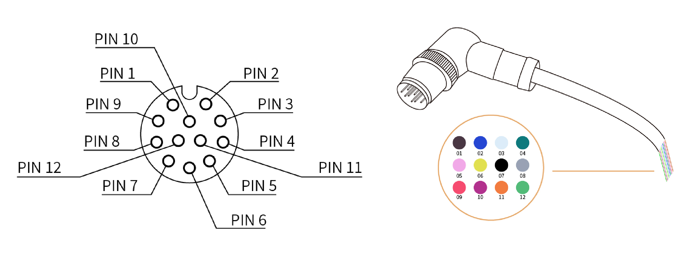
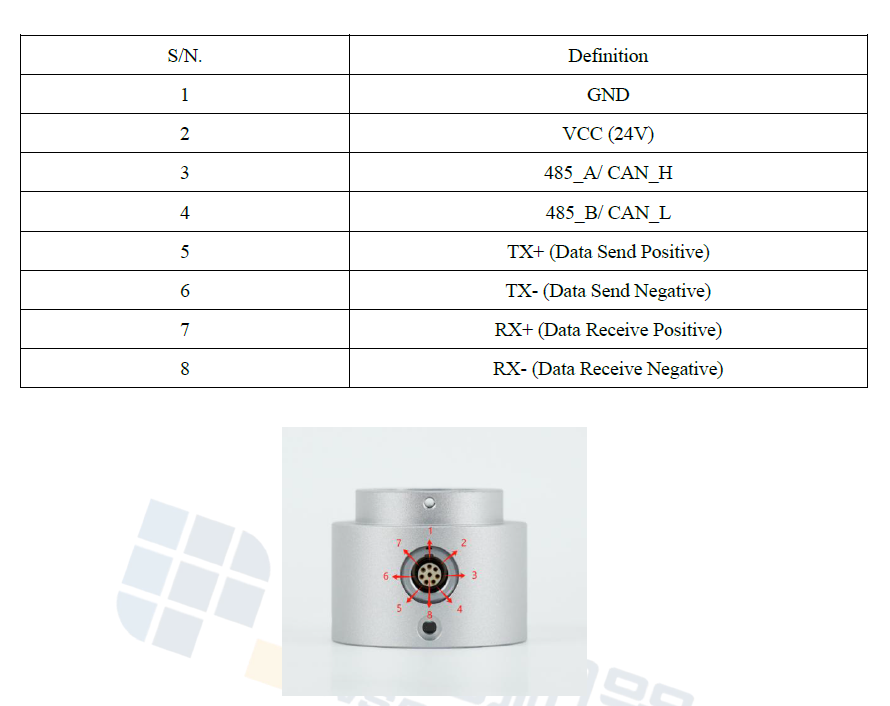
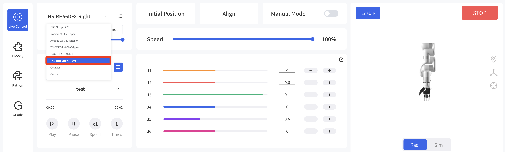
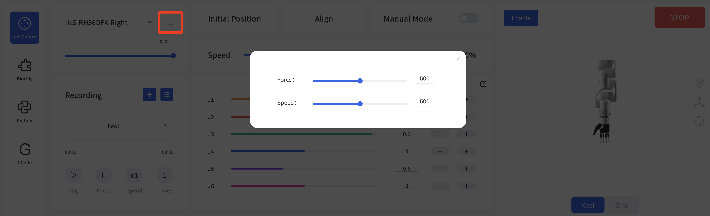
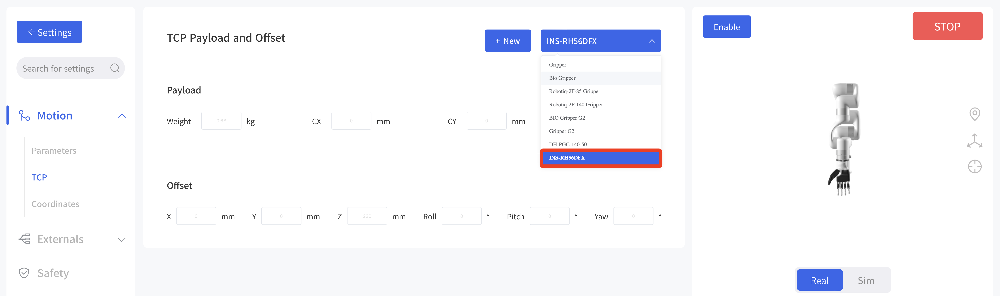
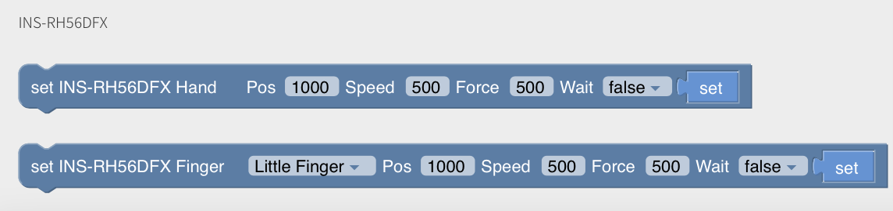

# UFACTORY Robotic Arm with Dexterous Hand RH56DFX

## Project Overview
This project demonstrates an application based on the **UFACTORY robotic arm** and the **INSPIRE-ROBOTS dexterous hands RH56DFX series**.  
Users can quickly control the dexterous hand via **UFACTORY Studio software**, implement fast grasping and other applications.  

The following videos show the dexterous hand grasping eggs and oranges, drilling cardboard with an electric drill, and controlling a computer mouse to switch web pages.

[](https://www.youtube.com/watch?v=-fEBGHV0h9Y)

## Hardware Requirements
* Robotic Arm: [UFACTORY](https://www.ufactory.cc/)- 850, xArm series (version 1305)
* Dexterous Hand: [Inspire Robots](https://en.inspire-robots.com/)  - RH56DFX-Left / RH56DFX-Right
## Hardware Connection
### Robotic Arm End Effector Definition
* **Plug in Connection**  


| Pin | Color | Signal      | Pin | Color | Signal            |
| --- | ----- | ----------- | --- | ----- | ----------------- |
| 1   | Brown | +24V (Power) | 7   | Black | Tool Output 0 (TO0) |
| 2   | Blue  | +24V (Power) | 8   | Gray  | Tool Output 1 (TO1) |
| 3   | White | 0V (GND)     | 9   | Red   | Tool Input 0 (TI0)  |
| 4   | Green | 0V (GND)     | 10  | Purple| Tool Input 1 (TI1)  |
| 5   | Pink  | User 485-A   | 11  | Orange| Analog Input 0 (AI0)|
| 6   | Yellow| User 485-B   | 12  | Light Green | Analog Input 1 (AI1) |

* **Contact Connection**  
  

### RH56DFX Dexterous Hand Definition


**Note:**  
The robotic arm end and the dexterous hand cannot be directly connected. Please contact Inspire Robots for an aviation adapter connector.

## Control Methods
### UFACTORY Studio Control
UFACTORY Studio Version: ≥ V2.7.0  

#### 1. Real-Time Control Interface
Select **INS-RH56DFX-Left** or **INS-RH56DFX-Right**.  
A pop-up will ask to set the robotic arm baud rate to 115200.  
Adjustable parameters: position, force, speed.  
  
  

#### 2. TCP Settings
Go to Settings - Motion Parameters - TCP Settings, then select INS-RH56DFX and save.  
  

#### 3. Blockly Control
Blockly provides two blocks for the dexterous hand, allowing control of either the entire hand or individual fingers.  
  

Optional parameters:  
* Finger: Little finger, Ring finger, Middle finger, Index finger, Thumb Flexion, Thumb Rotation, Entire hand  
* Position: 0–1000  
* Speed: 0–1000  
* Force: 0–1000  
* Wait option: Whether to wait for the current command to finish before sending the next (synchronous or asynchronous)  

### Python SDK Control
#### 1. Set UFACTORY Robotic Arm End Baud Rate
```python
code = arm.set_tgpio_modbus_baudrate(115200)
```
#### 2. Perform 485 Communication
```python
code, res_data = arm.getset_tgpio_modbus_data(modbus, timeout=100)
```

Example: [set_yinshi_rh56_gripper.py](https://github.com/xArm-Developer/xArm-Python-SDK/blob/master/example/wrapper/thridparty/set_yinshi_rh56_gripper.py)  
