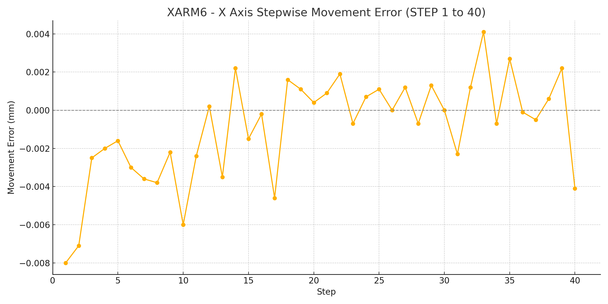
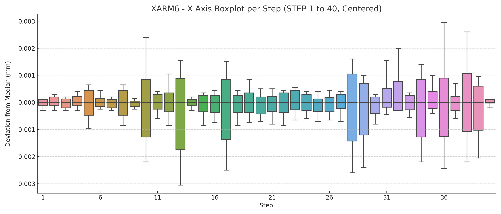
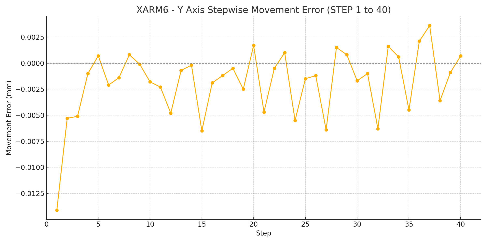
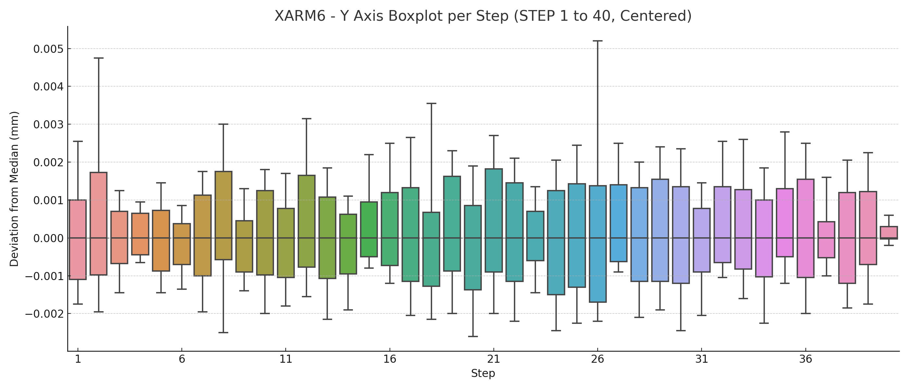
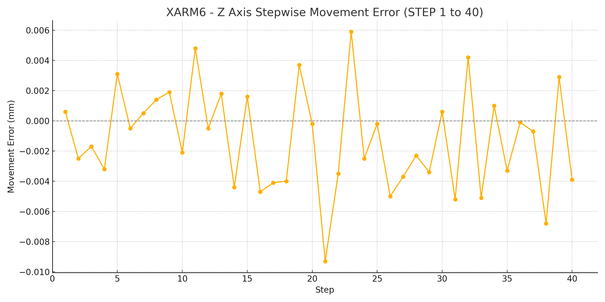
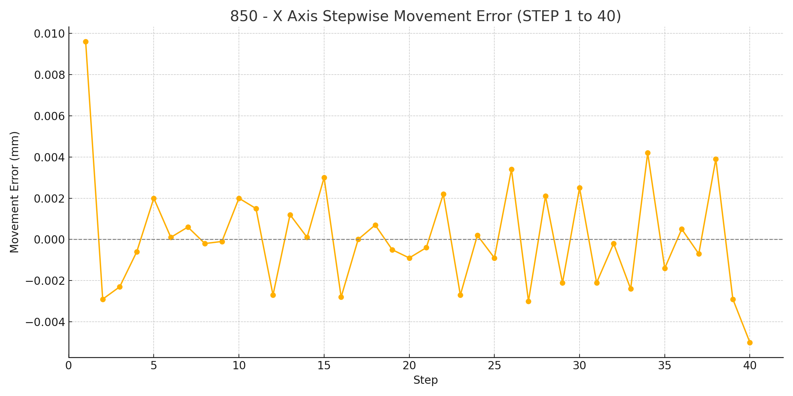
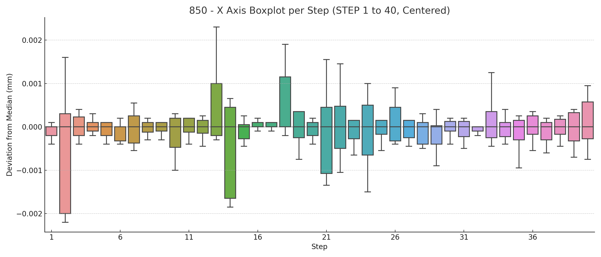

# 0.1 mm Displacement Test for 850 and xArm 6

## Measurement Method

* Each robotic arm starts from the specified initial position and moves in the X+, Y+, and Z+ directions with 0.1 mm step commands, repeated 40 times. A 3-second wait is applied after each movement.
* The actual movement distance is continuously measured by a Keyence GT2 contact-type digital sensor at a sampling frequency of 20 HZ.

### Test Conditions
The test is conducted at room temperature with a payload of 0 kg on the robotic arm.

### Robot Models and Initial Positions
| Product  | Model  | Direction | Initial Position                 |
|----------|--------|-----------|----------------------------------|
| xArm 6   | XI1305 | X+        | [298, 0, 200, 180, 0, 0]         |
| xArm 6   | XI1305 | Y+        | [300, -2, 200, 180, 0, 0]        |
| xArm 6   | XI1305 | Z+        | [300, 0, 198, 180, 0, 0]         |
| 850      | FX8510 | X+        | [298, 0, 200, 180, 0, 0]         |
| 850      | FX8510 | Y+        | [300, -2, 200, 180, 0, 0]        |
| 850      | FX8510 | Z+        | [300, 0, 198, 180, 0, 0]         |

### XYZ Movement Error
#### xArm6 XYZ Error

#### 850 XYZ Error

---
## XARM6
### X Axis

### Y Axis

### Z Axis

## 850
### X Axis

### Y Axis

### Z Axis

## Raw Data
Raw Data Download: [Click Here](https://www.ufactory.cc/wp-content/uploads/2025/06/850_xarm6_raw.zip)
