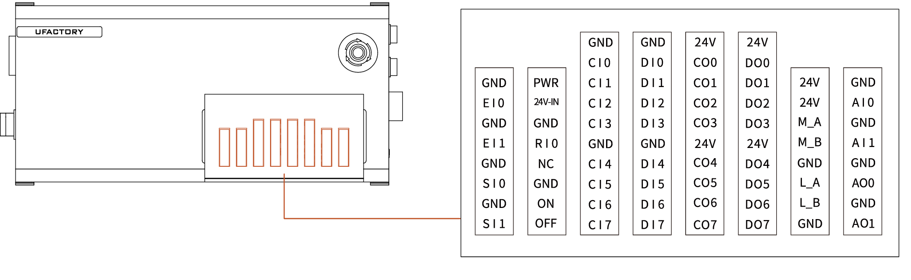
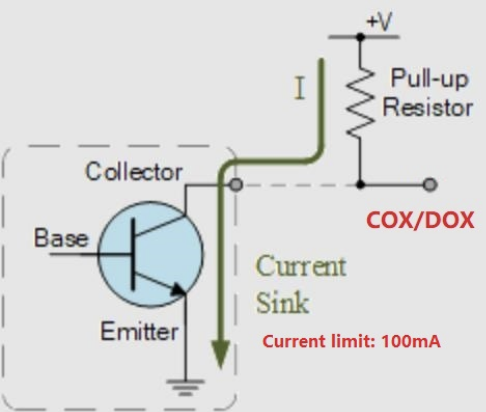
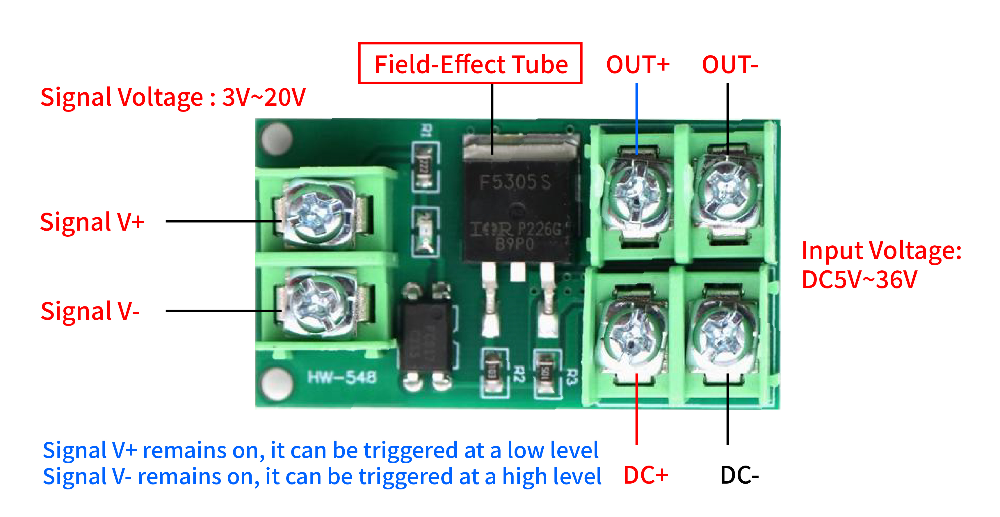

# Guide to use digital IO

There are 2 difference IOs of controller and end effector.
* Controller: 8/16 digital input, 8/16 digital output, 2 analog input, 2 analog output.
* End effector: 2/5 digital input, 2/5 digital output, 2 analog input
  
## 1. Controller IO(xArm1300/850/Lite6)

### 1.1 Digital Input
* CI0~CI7
* DI0~DI7

It's high level by default, 0-5V is low level, 18-30V is high level.

### 1.2 Digital Output
* CO0~CO7
* DO0~DO7
  
It's an OC output, NPN output, the current is 100mA.

## 2. End Effector IO

### 2.1 Digital Input
* TI0
* TI1
* TI2, TI3, TI4(UF850)

It's low level by default, the voltage is 0-30V, 1.6-30V is high level.

### 2.2 Digital Output
* TO0
* TO1
* TO2, TO3, TO4(UF850)

It's an OC output, NPN output, the current is 100mA.

## 3. Case
Purpose: Amplify the output current by adding PMOS Module.(Also applicable to COx/DOx)  
Application: Drive Relay

* Input Voltage: 3-24V; Current: 5mA.
* Output Voltage: 5-36V; Current: 5A, if it exceeds 5A, need to add a heat sink, and can't exceed 20A.

Connection:
* Signal V+ to 24V
* Signal V- to TOX
* DC to 24V
* DC to GND
* load V+ to OUT+
* load V- to OUT-

