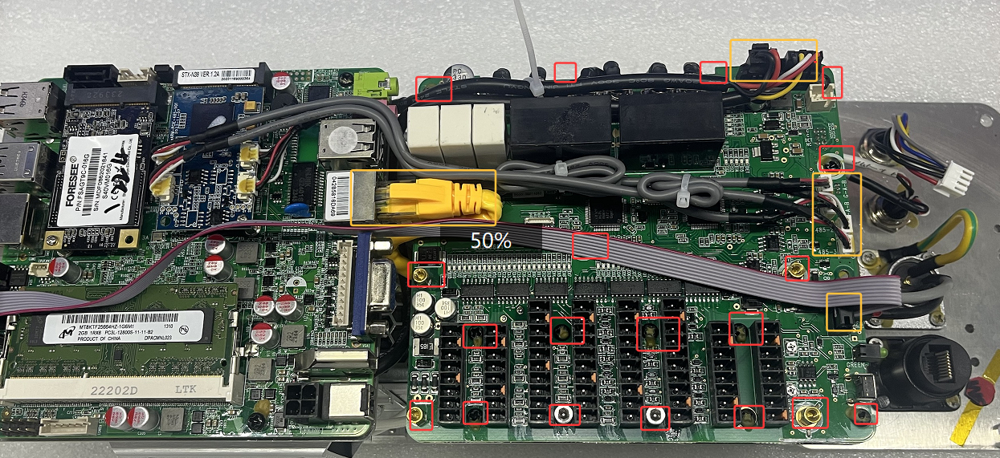
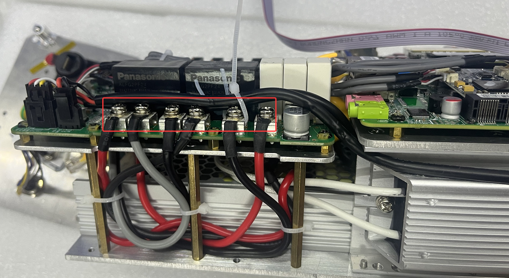
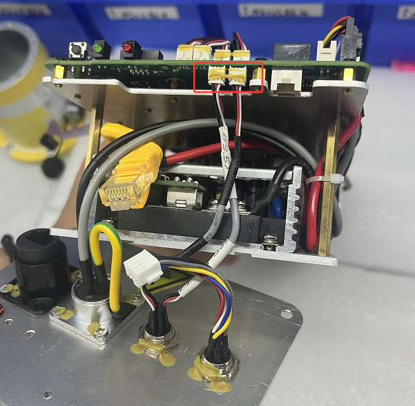

# 如何更换AC控制器的IO板

1. 请参考视频将控制器拆开。  
[如何拆开AC控制器?](https://drive.google.com/drive/folders/1LiDyIoOXd-MtC4zW8miXUTSSDuxyNhir?usp=sharing)

2. 移除19颗螺丝，将8根线缆拔下。
**请标记好各线缆的线序，复原时一一对应插入，若插错可能会将IO板烧坏。**

3. 移除6颗螺丝和线缆。

4. 将2根线缆拔下。

5. 更换新的IO板。