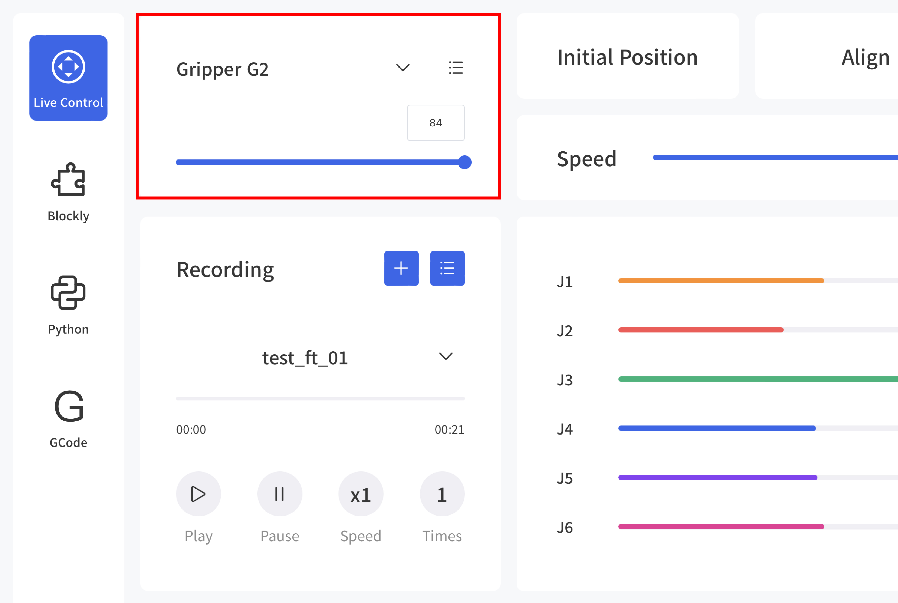
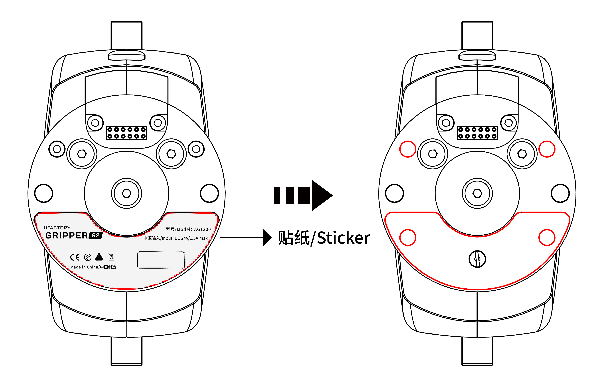
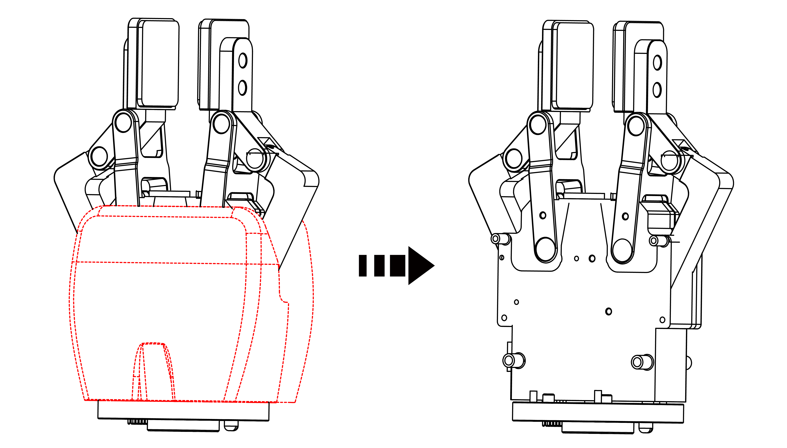

# How to take off the cover of gripper g2

## Step 1
Open the gripper via UFACTORY Studio.

## Step 2
Remove the SN sticker, unscrew 4 screws. Please keep the SN, it is the only proof for any after-sales requests.

## Step 3
Unscrew 4 screws on the top.

## Step 4
Remove the cover.

