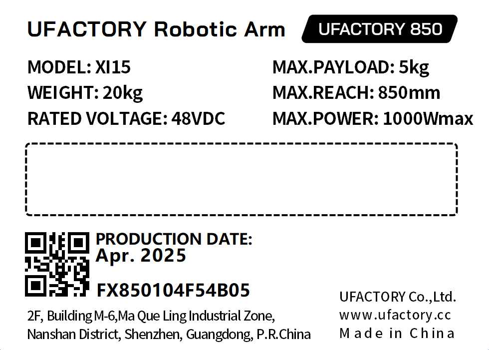

# 7. 产品信息

## 7.1 产品标签

* 机械臂标签

* 控制器标签

## 7.2 电磁兼容  
* IEC 61000-6-2:2005
* IEC 61000-6-4/A1:2010
* EN 61000-6-2:2005 [2004/108/EC]
* EN 61000-6-4/A1:2011 [2004/108/EC]  

电磁兼容性 (EMC)  
第 6-2 部分：通用标准 - 工业环境的抗抗干扰  
第 6-4 部分：通用标准 - 工业环境辐射标准  

这些标准定义了对电气和电磁干扰的要求。 符合这些标准可确保 UFactory 850 机器人在工业环境中表现良好，并且不会干扰其他设备。
EN 61000-6-4:2019
EN 61000-6-2:2019   

测量、控制和实验室用电气设备 - EMC 要求
第 3-1 部分：安全相关系统和旨在执行安全相关功能（功能安全）的设备的抗干扰要求 - 一般工业应用。该标准定义了安全相关功能的扩展 EMC 抗扰度要求。符合此标准可确保 UFactory 850 机器人的安全功能提供安全，即使其他设备超过 IEC 61000 标准中定义的 EMC 辐射限制。

## 7.3 使用环境
* 低湿度（25%-85% 无冷凝）
* 海拔高度：<2000m
* 环境温度：0°C ~ 50°C
* 避免阳光直射（室内使用）
* 无腐蚀性气体或液体。
* 无易燃材料。
* 无油雾。
* 无盐雾。
* 无灰尘或金属粉末。
* 无机械冲击、振动。
* 无电磁噪声。
* 无放射性物质。

## 7.4 运输、存储和搬运
* 通过UFactory studio将机器人移动到零点，然后将 UFactory 850机器人和控制器放入原包装中。
* 使用原包装运输机器人。
* 将机械臂从包装移至安装地点时，同时提起机械臂两侧的连杆，将机器人固定到位，直到所有安装螺栓都牢固地拧紧在机器人底座上。
* 控制器箱应通过手柄提起。
* 将包装材料保存在干燥的地方，以后可能需要打包和运输机器人。

## 7.5 控制器放置高度
* 控制器应放置在0.6m至1.5m的高度。

## 7.6 电源连接
本产品电源切断方式为插头/插座连接方式，所以在使用本产品的时候，建议配备适当的具有足够分断能力的开关电器。   
（如空气开关  绝缘电压：400V AC  额定电流：10A ）

## 7.7 特殊耗材
* 保险丝规格：15A 250V 5×20mm Time-Lag 玻璃体筒式保险丝

## 7.8 停机类别
**停止类别1**和**停止类别2**会在驱动器电源打开的情况下使机器人减速，这使机器人能够在不偏离当前路径的情况下停止。

| 安全输入            | 描述   |
| --------------- | ---- |
| 控制器上的紧急停止按钮     | 1类停机 |
| 控制器上的紧急停止输入（EI） | 1类停机 |
| 控制器上的防护停止输入（SI） | 2类停机 |

## 7.9 停止时间和停止距离
**1类停机**的停止距离和时间：  
下表包括触发1类停机时测量的停止距离和停止时间。 这些测量值对应于机器人的以下配置：
* 臂展：100%(机器人手臂完全水平伸展) 。
* 速度：100%(机器人的一般速度设为100%，以180°/s 的关节速度进行移动) 。
* 负载: 机械臂可以承受的最大有效载荷(5 kg).  

通过执行水平移动( 即旋转轴垂直于地面) 对关节1 进行测试。在对关节2 和关节3 的测试过程中，机器人遵循垂直轨迹，即旋转轴平行于地面，并在机器人向下移时停止。

|     | 停止距离(rad) | 停止时间(ms) |
| --- | --------- | -------- |
| 关节1 | 0.62      | 521      |
| 关节2 | 1.12      | 885      |
| 关节3 | 0.67      | 577      |

## 7.10 证书
[DSS_MD-GZES2403005468MD.pdf](http://www.ufactory.cc/wp-content/uploads/2025/04/DSS_MD-GZES2403005468MD.pdf)  

[DSS_GZEM2403001755MDVR.pdf](http://www.ufactory.cc/wp-content/uploads/2025/04/DSS_GZEM2403001755MDVR.pdf)  

## 7.11 运动学参数

[运动学参数](http://docs.supportarticle.ufactory.cc/zhHans/support_articles/developer/kinematic-and-dynamic-parameters/ufactory-850.html)
