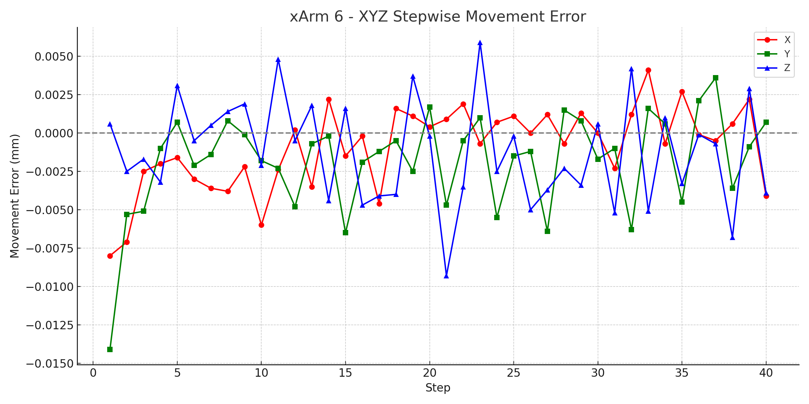
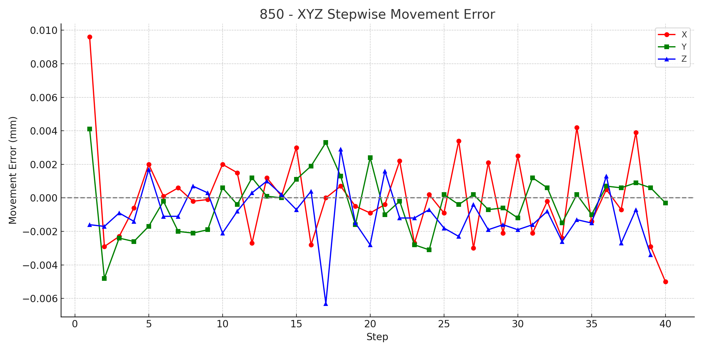
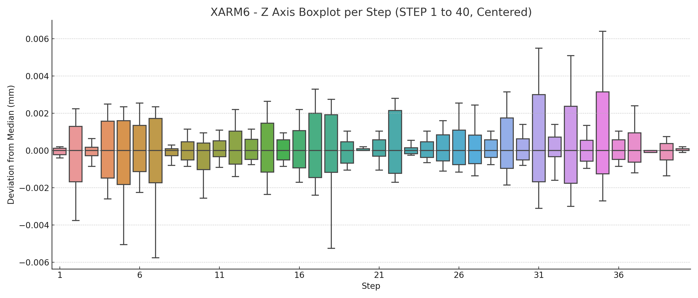
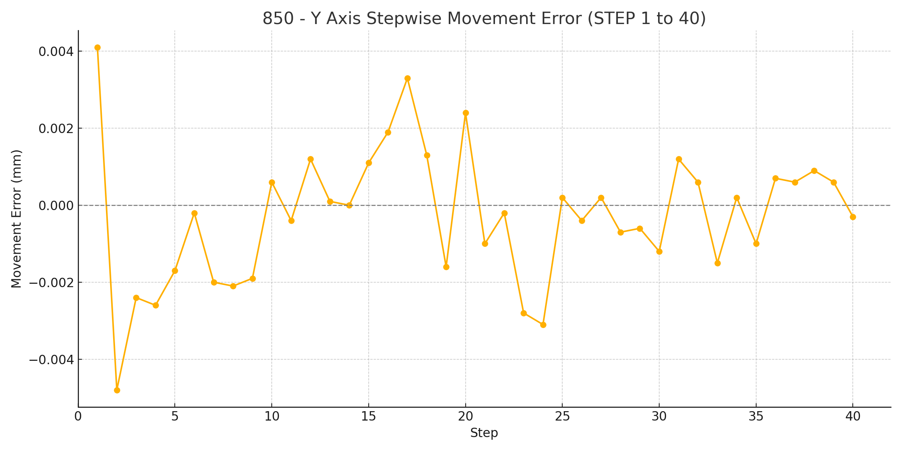
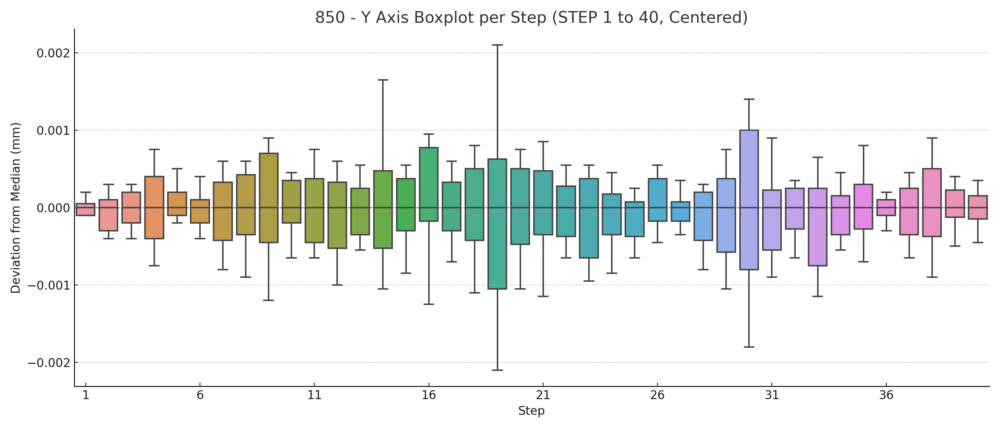
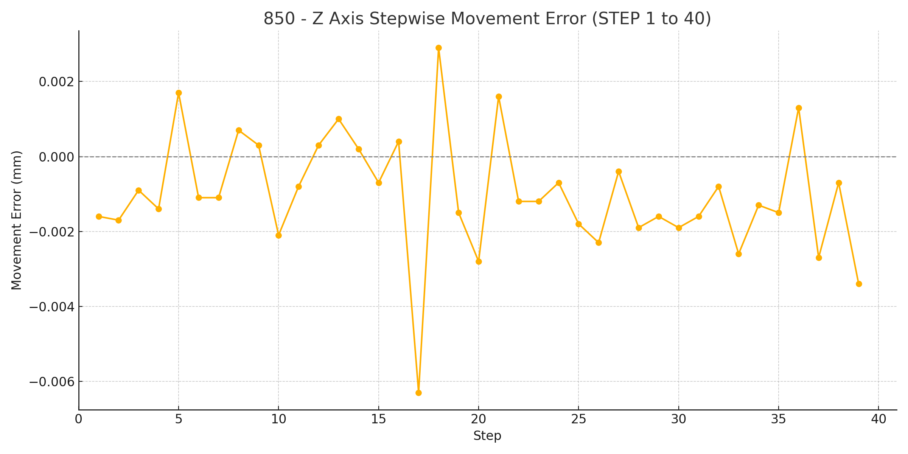
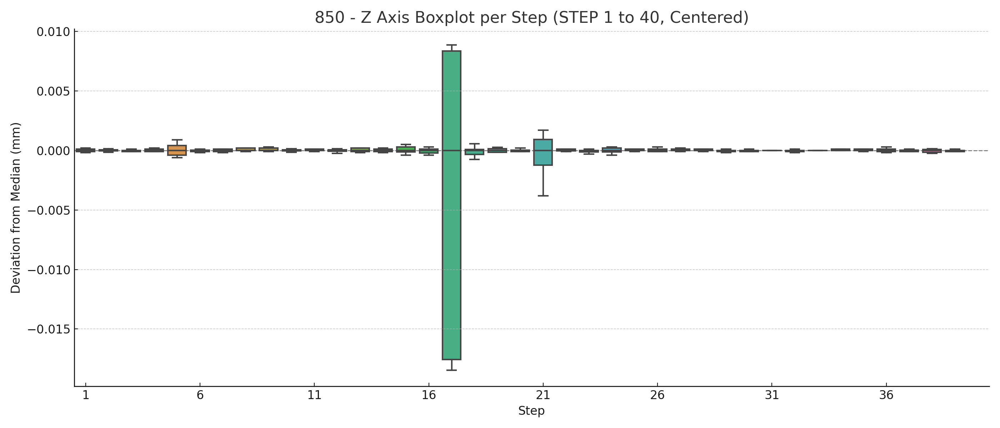

# 850 与 xArm 6 0.1 mm 位移测试

## 测量方法

* 各型号机械臂由下列初始位置出发，向 X+、Y+、Z+方向以每次0.1 mm 步进指令移动40次，每次移动等待时间为3秒。
* 实际移动距离通过基恩士GT2接触式数字传感器连续测量，采样频率为20HZ。

### 测试条件
测试在室温进行，机械臂的负载是 0kg
### 机械臂型号和初始位置
| 产品     | 型号   | 移动方向 | 初始位置                        |
|----------|--------|-----------|----------------------------------|
| xArm 6   | XI1305 | X+        | [298, 0, 200, 180, 0, 0]         |
| xArm 6   | XI1305 | Y+        | [300, -2, 200, 180, 0, 0]        |
| xArm 6   | XI1305 | Z+        | [300, 0, 198, 180, 0, 0]         |
| 850      | FX8510 | X+        | [298, 0, 200, 180, 0, 0]         |
| 850      | FX8510 | Y+        | [300, -2, 200, 180, 0, 0]        |
| 850      | FX8510 | Z+        | [300, 0, 198, 180, 0, 0]         |

## 测试结果

- 每步移动误差图（与理论值 0.1 mm 的差值）
- 以中值为中心的箱线图，展示每步采样点的波动情况

---
### XYZ 移动误差
#### xArm6 XYZ 误差图

#### 850 XYZ 误差图

---
## xArm 6
### X 方向

### Y 方向

### Z 方向

---
## 850
### X 方向

### Y 方向

### Z 方向

## 原始数据
原始数据下载：[点击下载](https://www.ufactory.cc/wp-content/uploads/2025/06/850_xarm6_raw.zip)
