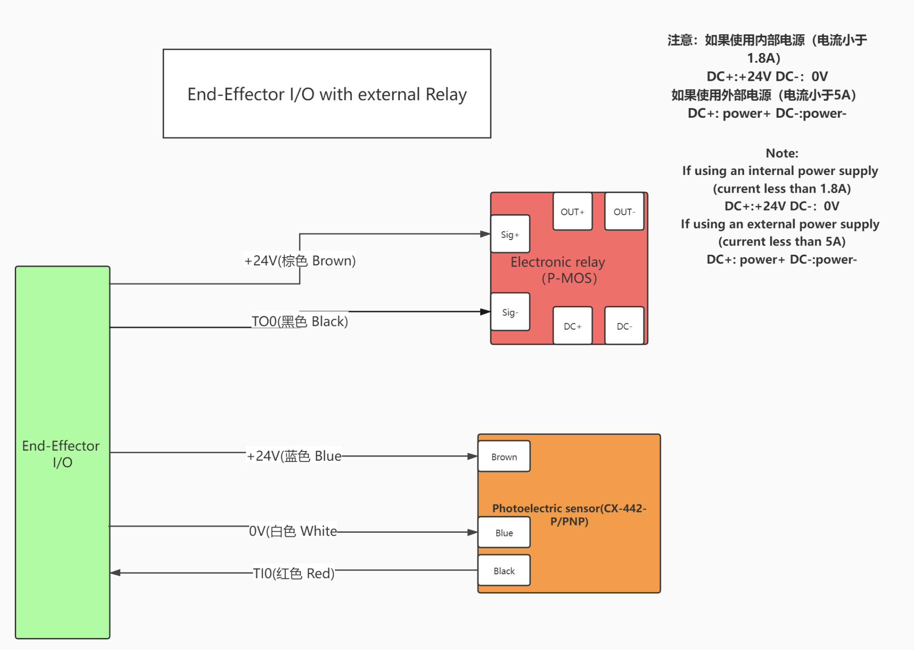

# IO使用指南

控制器和末端IO是两种不同的IO。  
控制器：16路数字输入，16路数字输出，2路模拟输入，2路模拟输出  
末端：2路数字输入，2路数字输出，2路模拟输入

## 1. 控制器IO（xArm13xx/850/Lite6）

### 1.1 数字输入
* CI0~CI7
* DI0~DI7

默认为高电平，0-5V为低电平，18-30V为高电平。

### 1.2 数字输出（OC输出）
* CO0~CO7
* DO0~DO7

控制器输出为OC输出，NPN输出，输出电流为100mA。

## 2. 末端IO

### 2.1 数字输入
* TI0
* TI1
* TI2, TI3, TI4(UF850)

默认为低电平，电压0-30V，1.6V-30V为高电平。

### 2.2 数字输出
* TO0
* TO1
* TO2, TO3, TO4(UF850)

末端IO输出为OC输出，NPN输出，输出电流100mA。

## 3. 案例
目的：放大末端输出电流，通过增加PMOS开关。（也适用于COx/DOx）  
应用：例如驱动继电器

[PMOS模块购买参考](https://item.taobao.com/item.htm?spm=a230r.1.14.1.61841acbDq3Hsu&id=627815346924&ns=1&abbucket=14#detail)

* 输入信号电压：3V~24V；电流：5ma左右。
* 输出被控电压：5V~36V。电流：5A以内  大于5A需要加散热片，最大不能超过20A。

连接：
* 信号正极接24V
* 信号负极接TOx
* DC+接24V（使用内部电源）,如果使用外部电源，接外部电源正极
* DC-接GND（使用内部电源）,如果使用外部电源，接外部电源负极
* 负载正极接OUT+
* 负载负极接OUT-
