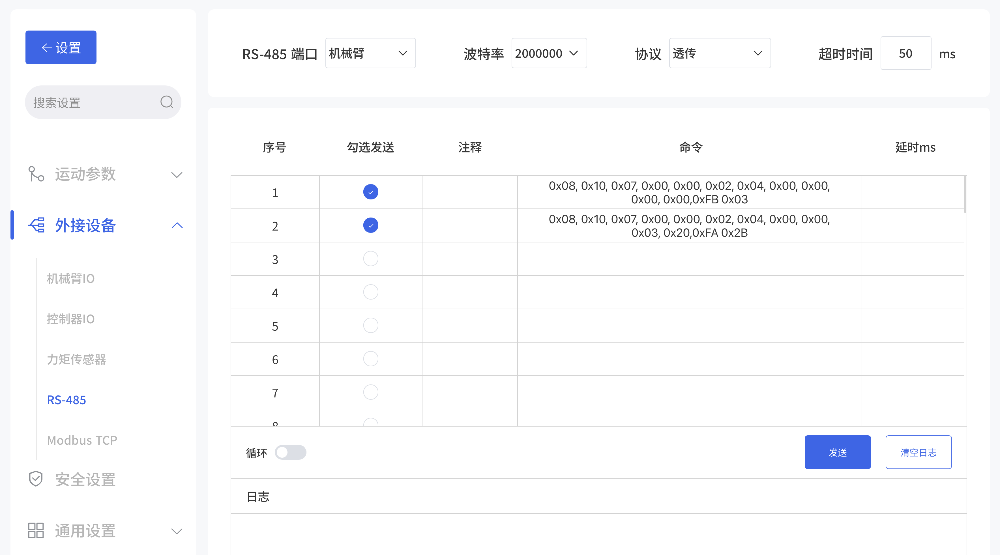

# 如何在末端使用透传功能？

当末端工具支持RS-485通讯但不支持标准Modbus RTU协议时，可使用末端透传功能，此功能将数据直接转发至末端板，不进行任何数据处理。

## 硬件连接
机械臂末端引角定义图如下，需要连接:

* pin1 & pin2: 24V
* pin3 & pin4: GND
* pin5: RS485A
* pin6: RS485B

## 控制
* 末端波特率和末端工具波特率需要保持一致，末端默认波特率为2M;
* 末端超时时间默认为50ms，需要根据末端工具的超时时间调整；

### UFACTORY Studio控制
版本要求：≥V2.7.0；  

进入设置-外接设备-RS485界面。
可选参数：
* RS-485端口：选择机械臂；
* 波特率；
* 协议：选择透传；
* 超时时间；


**注意：修改完参数后请点击保存按钮。**

### Python SDK控制

#### 1. 设置波特率
```python
code = arm.set_tgpio_modbus_baudrate(2000000)
```
#### 2. 设置超时时间
is_transparent_transmission需要设置为True，默认为False。 
```python
code = arm.set_tgpio_modbus_timeout(timeout=1000, is_transparent_transmission=True)
```

#### 3. 发送相应的RS485数据
is_transparent_transmission需要设置为True，默认为False。  
use_503_port需要设置为True，默认用502端口。
```python
#open gripper
code, ret = arm.getset_tgpio_modbus_data(datas=[0x08, 0x10, 0x07, 0x00, 0x00, 0x02, 0x04, 0x00, 0x00, 0x03, 0x20, 0xFA, 0x2B], is_transparent_transmission=True, use_503_port=True)
print('open gripper, code={}, ret={}'.format(code, ret))
time.sleep(0.5)


#close gripper
code, ret = arm.getset_tgpio_modbus_data(datas=[0x08, 0x10, 0x07, 0x00, 0x00, 0x02, 0x04, 0x00, 0x00, 0x00, 0x00, 0xFB, 0x03 ], is_transparent_transmission=True, use_503_port=True)
print('close gripper, code={}, ret={}'.format(code, ret))
time.sleep(0.5)
```