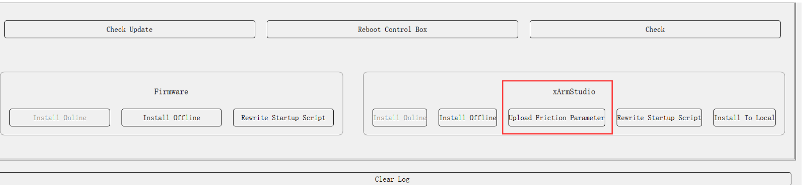

# 更换控制器里的SN

## 摩擦力文件的存储与使用
### 摩擦力文件的存储
软件上显示的SN是摩擦力文件的文件名中的一部分。一份摩擦力文件的文件名如 dynconfig_XI130501F53A17.yaml，其中XI130501F53A17是机械臂的SN.
在早期的xArm 中，摩擦力文件只存储在控制盒中，后面由于发现用户经常会更换控制盒，导致控制盒内存储的SN与机械臂标签的SN不一致，所以xArm 从1300版本版本开始, 摩擦力文件除了存储在控制盒里，还会另存储一份在机械臂上。Lite 6 和850 从第一个版本开始，SN 就同时存储控制盒和机械臂上。

### 摩擦力文件的校验

* 固件版本＜V2.4.0
如果控制盒内没有摩擦力文件，固件可以正常启动运行。
但是由于没有摩擦力文件，碰撞检测和拖动示教功能会发生异常。比如没有发生碰撞缺误报碰撞检测误报，或者发生碰撞但是没有触发碰撞检测。比如开启手动模式后，某个关节缓慢下坠，或者拖动时某几个关节拖动非常费力。

* 固件版本≥2.4.0
如果控制盒内没有摩擦力文件，固件启动后会报出C44错误，机械臂无法运行。

## 更换控制盒后重新加载摩擦力文件的方法

### 不同机械臂型号的摩擦力加载方法

除了比较早的产品xArm 5/6/7（XX1300 之前版本）外，机械臂的摩擦力文件都存储在机械臂上，只要在控制器固件启动后，拍一次急停，松开，就可以重新加载摩擦力文件。参考下表。

| 机械臂型号    | 摩擦力存储位置 |摩擦力重载方式|
| --- | --- | --- |
|  850   |   机械臂&控制器  | 拍一次急停，松开 |
| Lite 6 | 机械臂&控制器 | 拍一次急停，松开 |
| xArm 5/6/7 (XX1300及之后的版本) | 机械臂&控制器 | 拍一次急停，松开| 
| xArm 5/6/7 (XX1300 之前版本) | 控制器| 使用GUI工具加载| 

### xArm 5/6/7（XX1300 之前版本）使用GUI 工具加载摩擦力文件的方法

联系UFACTORY 技术支持，将机械臂SN发送给技术支持，技术支持发送摩擦力文件给你。
下载和运行GUI 工具,下载链接: http://update.ufactory.cc/xarm-tool-gui-2.16.10.zip
点击加载摩擦力文件按钮，加载摩擦力文件。加载完成后，重启控制盒生效。

